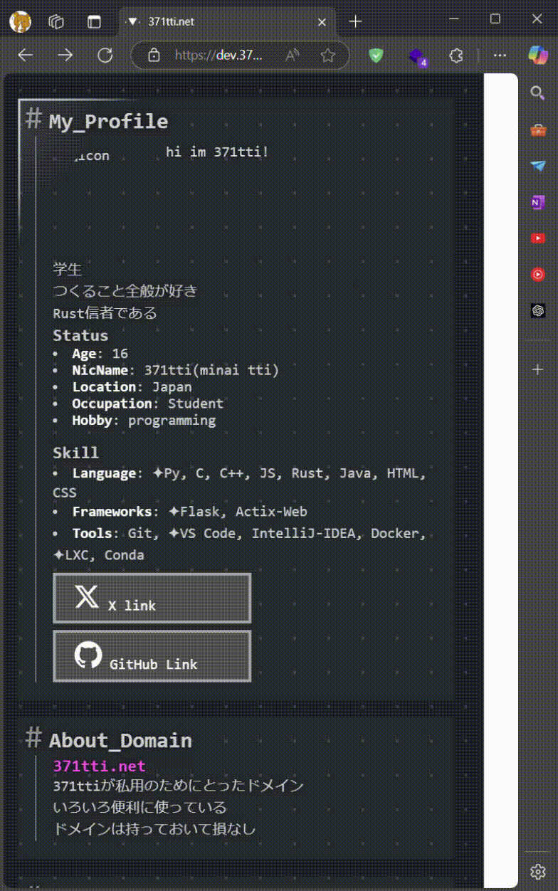

### **README (日本語版)**
[english](README-en.md)

# モダンボーダーエフェクト

このプロジェクトは、HTML要素に対して動的なモダンボーダーエフェクトを適用するCSSとJavaScriptのセットアップを提供します。マウスの動きに応じて、エレガントなボーダーとマスクが表示されます。

---

## **デモ**


---

## **使用方法**

1. `modern-border.css` と `modern-border.js` をプロジェクトに追加します。
2. HTMLファイルに以下のような要素を追加します。

```html
<div class="modern-border">
    <p>モダンボーダーエフェクトのデモ</p>
</div>
```

3. HTMLファイルでCSSとJavaScriptを読み込みます。

```html
<link rel="stylesheet" href="modern-border.css">
<script src="modern-border.js" defer></script>
```

---

## **カスタマイズ**

以下のプリセットスタイルが使用できます。

- **警告 (`.warning`)**: オレンジの点線ボーダー。
- **情報 (`.info`)**: 青い実線ボーダー。
- **成功 (`.success`)**: 緑の点線ボーダー。
- **エラー (`.error`)**: 赤い実線ボーダー。

```html
<div class="modern-border warning">警告スタイル</div>
<div class="modern-border info">情報スタイル</div>
<div class="modern-border success">成功スタイル</div>
<div class="modern-border error">エラースタイル</div>
```

---

## **開発者向け情報**

- `modern-border.css` でスタイルを編集できます。
- `modern-border.js` を修正して動作を変更できます。

---

